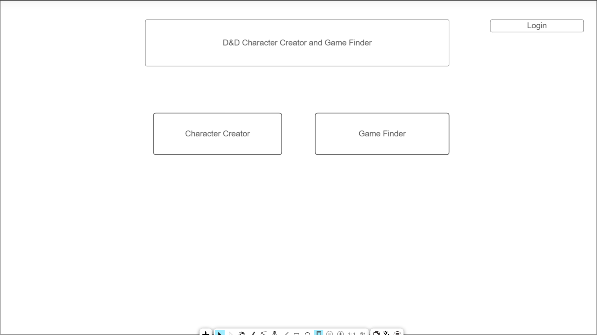
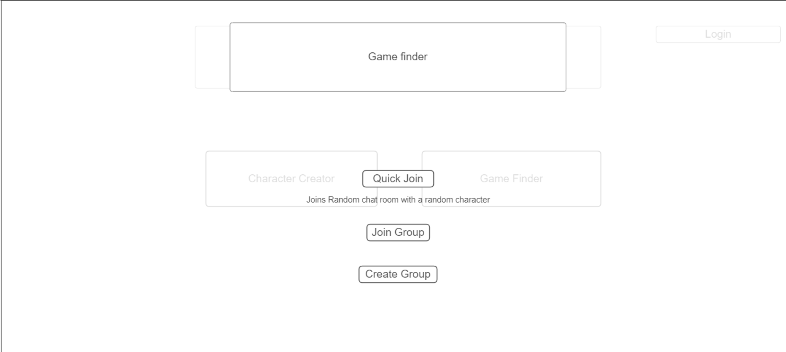

# Startup
Repository for web development

## Startup Specification

- Pitch
  - Dungeons and Dragons along with many other role-playing games have highly specific character building methods that easily confuse the players. Using the Character Creator, players can make all of the easy decisions while all of the stats are automatically calculated. The other Problem with the game is finding friends to play who are closeby and have time. The game finder function will connect players to chat rooms where they can play the game with random players or with players of their choosing.

  

